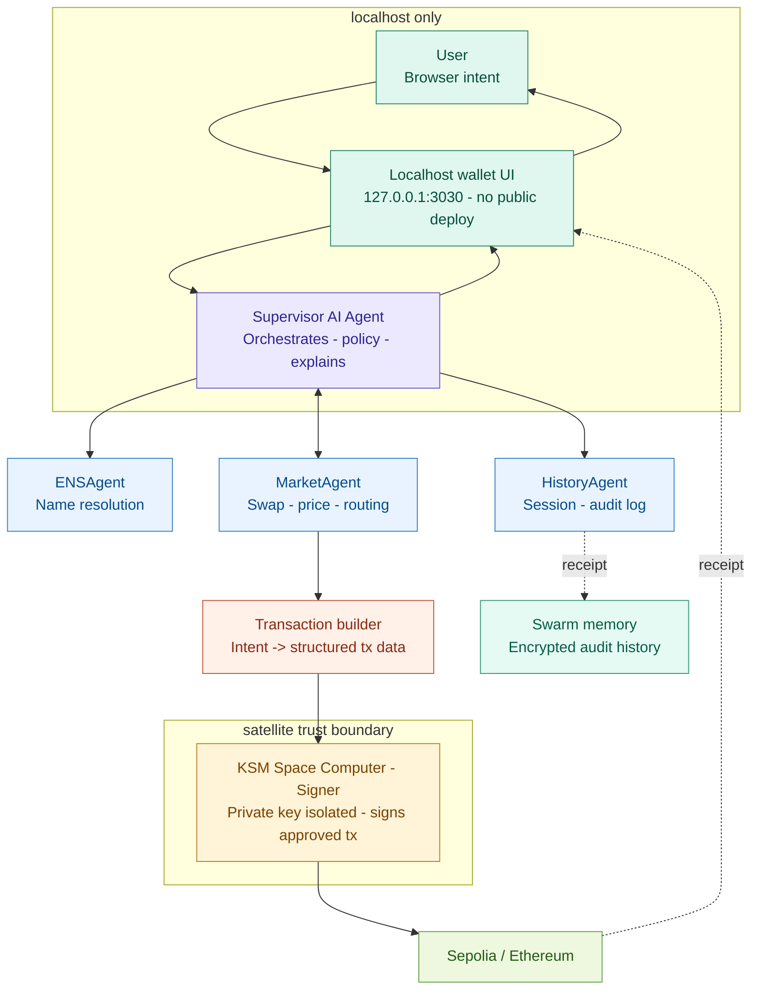

# Jimmy Agent

**Satellite-backed AI wallet with decentralized memory on Swarm.**

Jimmy Agent is a local-first autonomous Web3 wallet where transaction intent is created in the browser, analyzed by an AI security agent, signed through a KMS Space Computer / satellite-backed signing environment, and archived as encrypted agent memory on Swarm.

The core idea is simple:

> The AI agent can reason, but it cannot steal.  
> The browser can create intent, but it is not the signer.  
> The final signing authority lives in a satellite-backed trust layer.

---

## Problem

Crypto wallets are still dangerous for normal users and autonomous agents.

Today, users are asked to sign opaque transactions they do not understand. Browser wallets can be phished. Server-side signing creates hot-key risk. AI agents can prepare useful financial actions, but giving an AI agent direct custody of funds is unsafe.

The main risks are:

- malicious or compromised frontends
- phishing transactions and fake swaps
- unlimited approvals
- server key compromise
- transaction tampering between UI and signer
- centralized agent memory and missing audit trails

For autonomous Web3 agents to become useful, they need a safer signing model.

---

## Solution

Jimmy Agent separates wallet execution into three trust layers:

1. **Local-first wallet UI**  
   The user creates transaction intent locally through a localhost web interface.

2. **AI security agent**  
   The agent interprets the user's intent, explains actions, and helps prepare safer transactions.

3. **Satellite-backed signer**  
   Transactions are signed through a KMS Space Computer / satellite-backed signing environment instead of a normal browser wallet or hot backend key.

4. **Swarm memory layer**  
   Agent session history and security context can be encrypted and stored on Swarm as decentralized memory and audit history.

This creates a wallet where the agent helps, but does not custody funds.

---

## Why Satellite Signing?

Traditional server-side signing concentrates risk in a hot backend key. If the backend, cloud secrets, CI/CD pipeline, or deployment environment is compromised, an attacker may be able to sign arbitrary transactions.

Jimmy moves the signing authority out of the normal web attack surface.

The browser does not own the private key.  
The backend does not become the custodian.  
The AI agent does not directly control funds.

Instead, the transaction is signed through a satellite-backed KMS Space Computer environment.

This changes the threat model:

- the private key is not stored in a hosted web app
- the signer is separated from the browser UI
- the signer can become a dedicated policy-enforced trust boundary
- compromised frontend code cannot directly extract the key
- AI-generated actions can be checked before signing

> We do not make the AI agent a custodian.  
> The agent proposes and explains actions, while the satellite-backed signer remains the authority.

---

## Why Localhost?

Jimmy is local-first by design.

For a normal app, deployment is convenience.  
For a wallet, deployment is part of the attack surface.

A hosted wallet frontend depends on DNS, CDN, hosting, deployment pipelines, and mutable JavaScript bundles. If any part of that chain is compromised, the UI can lie about what the user is signing.

Running the wallet locally removes the public web deployment layer from the trusted transaction path.

The local UI creates intent.  
The satellite-backed signer produces signatures.  
The hosted website is not part of the custody model.

---

## Why AI Agent?

The agent is not trusted with money. The agent is trusted with interpretation.

Web3 transactions are hard to understand:

- ETH vs WETH
- token approvals
- slippage
- contract calldata
- recipient risk
- swap routing
- wrap / unwrap flows
- suspicious transaction patterns

Jimmy Agent helps users understand and prepare actions in human language.

Example:

> "Swap my USDC back to ETH."

The agent can understand that this means:

1. Swap USDC to WETH through Uniswap.
2. Unwrap WETH to native ETH.
3. Explain the transaction before signing.

The final signature still happens in the satellite-backed signing layer.

---

## Why Swarm?

Autonomous agents need memory.

Most AI wallet demos are stateless: the agent responds, forgets, and loses context. Jimmy uses Swarm as decentralized storage for encrypted agent session history.

Swarm can be used for:

- encrypted agent memory
- transaction context
- audit history
- risk analysis records
- session restoration
- decentralized logs of agent decisions

This makes Jimmy a stateful Web3 agent rather than a one-off chat interface.

> Satellite signing gives the wallet a secure hand.  
> The AI agent gives it reasoning.  
> Swarm gives it memory.

---

## Demo Flow

The demo shows a complete local-first wallet flow:

1. Initialize the satellite-backed wallet key.
2. Display the generated wallet address.
3. Swap ETH to USDC on Sepolia.
4. Swap USDC to WETH.
5. Unwrap WETH to native ETH.
6. Send ETH to another address.
7. Ask Jimmy Agent to explain or prepare an action.
8. Archive encrypted agent session history to Swarm.

---

## Architecture



---

## Key Features

- Local-first wallet interface
- Satellite-backed transaction signing concept
- AI agent for transaction interpretation
- Sepolia ETH transfer
- Uniswap Sepolia swaps
- USDC, WETH, and native ETH support
- WETH wrap / unwrap flow
- Token balance display
- Clickable max balance input
- Swarm-backed encrypted session memory
- Localhost-first security model

---

## Tech Stack

- HTML / CSS / JavaScript wallet UI
- Bun local wallet server
- Sepolia RPC
- Uniswap V3 Sepolia
- KMS Space Computer / satellite-backed signing flow
- USB Armory MK II / Raspberry Pi
- Swarm encrypted session storage
- Multi-agent Node.js backend
- **`swarm-kv`** — small Swarm-backed key-value library (`swarm_tests/swarm-kv`, see below)

---

## Swarm key-value library (`swarm_tests/swarm-kv`)

This repo includes **`swarm-kv`**: a developer-facing **`get(key)` / `put(key, value)`** layer on Ethereum Swarm (feeds per key + a listable index). It targets hackathon / bounty criteria: string, JSON, and binary values; **`keys` / `entries` / `delete`**; one postage batch threaded through all uploads; runnable examples and `npm test` without a Bee node for codec tests.

| Read this | Why |
|-----------|-----|
| **[`swarm_tests/swarm-kv/README.md`](swarm_tests/swarm-kv/README.md)** | Full API, quickstart, architecture, judging rubric mapping, and how the **wallet** uses the library vs. the generic examples. |

**Wallet integration (encrypted memory, not the generic KV demo):** after each agent turn, `agents` writes `agents/logs/session_history.json`, then **`sessionHistorySwarm.js`** encrypts the full JSON and **`put`s** a single key (`session_history`, namespace `wallet-agent-session`) via the same `SwarmKV` class. See the table in the swarm-kv README.

---

## Running Locally

Start the wallet development environment:

```bash
./scripts/wallet-start-dev.sh
```

Then open:

```txt
http://127.0.0.1:3030
```

The app is intentionally local-first. The wallet UI is not deployed as a public hosted frontend because the frontend is part of the transaction trust surface.

---

## Security Model

Jimmy Agent is designed around separation of responsibility:

| Layer | Responsibility |
|---|---|
| Local UI | Creates user intent |
| AI Agent | Explains and prepares actions |
| Policy / Builder | Converts intent into structured transaction data |
| Satellite Signer | Signs approved transactions |
| Swarm | Stores encrypted memory and audit context |

The agent does not directly own funds.  
The browser does not directly own the signing key.  
The backend does not act as a traditional hot wallet custodian.

---

## Hackathon Summary

Jimmy Agent is a satellite-backed autonomous wallet with decentralized memory.

It combines:

- AI-assisted transaction reasoning
- local-first wallet UX
- satellite-backed signing through KMS Space Computer
- encrypted Swarm memory for agent history
- real onchain Sepolia execution

The result is a wallet architecture where autonomous agents can help users perform financial actions without becoming the custody layer themselves.
